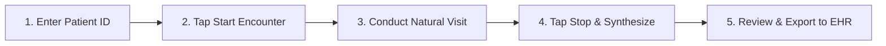

# 🩺 Clinician's Handbook & Practice Guide
### **Mr Doctor • Ambient AI Documentation Specialist for Healthcare Providers**

> *"Spend your clinical hours engaging patients face-to-face — let ambient AI eliminate the documentation burden."*

---

## 📑 Table of Contents
1. [Executive Summary for Physicians](#1-executive-summary-for-physicians)
2. [Exam Room Setup & Audio Hygiene](#2-exam-room-setup--audio-hygiene)
3. [Pre-Configured AI Engine (Groq Default)](#3-pre-configured-ai-engine-groq-default)
4. [Mastering the Ambient Consultation Workflow](#4-mastering-the-ambient-consultation-workflow)
5. [Clinical Verbalization Techniques (OLDCARTS / Exam Maneuvers)](#5-clinical-verbalization-techniques)
6. [Multilingual & Code-Switching Consultations](#6-multilingual--code-switching-consultations)
7. [Navigating the SOAP Note Architecture](#7-navigating-the-soap-note-architecture)
8. [EHR Integration & Clipboard Export (Epic, Cerner, Athena)](#8-ehr-integration--clipboard-export)
9. [Patient Privacy, HIPAA Architecture & Zero-Retention](#9-patient-privacy--zero-retention)
10. [High-Volume Clinic Pro-Tips & FAQ](#10-high-volume-clinic-pro-tips--faq)

---

## 1. Executive Summary for Physicians

**Mr Doctor** is an ambient clinical scribe engineered to eliminate after-hours "pajama-time" EHR charting. Unlike dictation tools that require you to speak commands like *"comma"* or *"new paragraph"*, Mr Doctor operates entirely in the background:

- **Listens naturally** to the unedited, bidirectional conversation between you and your patient.
- **Filters clinical signal from ambient noise**, small talk, and pleasantries.
- **Synthesizes structured, hospital-standard SOAP notes** within seconds of concluding the visit.
- **Guarantees zero-retention**: encounter audio is automatically purged from memory the instant transcription completes.

---

## 2. Exam Room Setup & Audio Hygiene

To ensure clinical transcript precision (>99% accuracy across medical terminology), follow these simple room ergonomics:

| Factor | Recommended Practice | To Avoid |
| :--- | :--- | :--- |
| **Device Placement** | Centered on your desk, equidistant (1–2 meters) between clinician and patient. | Tucking the phone/laptop under folders or behind monitors. |
| **Microphone Orientation** | Unobstructed microphone pointing toward the seating area. | Covering the bottom mic on Android devices with your hand. |
| **Background Noise** | Gentle consultation room ambient sound is fine. | Positioning directly underneath noisy HVAC blowers or white-noise machines. |
| **Exam Maneuver Verbalization** | Speak your physical exam findings out loud during examination. | Performing silent exams without speaking findings. |

> [!TIP]
> **Laptop or Android Tablet:** On Windows laptops, the built-in microphone array works seamlessly. For busy outpatient clinics with high room echo, an inexpensive USB directional desktop microphone provides studio-grade clarity.

---

## 3. Pre-Configured AI Engine (Groq Default)

Mr Doctor is built with a dual-engine architecture optimized for **zero latency and clinical precision**:

```
🎙️ Audio Capture (AAC-LC)
        │
        ▼
⚡ Whisper Large v3 (Sub-second STT via Groq)
        │
        ▼
🤖 Groq Cloud: GPT-OSS 20B / Compound Mini (Active Default)
   • Ultra-fast open-weights clinical reasoning (< 2 seconds)
   • 100% Free-Tier Key Support with Zero Cloud Storage
        │
        ▼
📄 Board-Certified SOAP Note with ICD-10 & Treatment Protocol
```

### Configuring Your Free API Key
1. Open **Settings** (⚙️ icon in the top right corner).
2. Mr Doctor defaults to **Groq Cloud (GPT-OSS 20B / Compound Mini)**.
3. Paste your free **Groq API Key** (or use the built-in pre-configured test key).
4. Tap **Test Groq Connection** — you will see an immediate green confirmation badge: `Connection successful`.
5. Tap **Save Configuration**.

---

## 4. Mastering the Ambient Consultation Workflow



### Step 1: Patient Identification
- Enter the **Patient Identifier** (e.g., `PT-10492` or MRN) and an optional **Visit Title** (e.g., `Cardiology Follow-Up`, `Annual Wellness`).
- *Note:* To maximize HIPAA compliance, use Patient IDs or MRNs instead of full names.

### Step 2: Begin Ambient Capture
- Tap **Start Clinical Encounter**.
- Observe the real-time **audio waveform visualizer** to verify the microphone is capturing audio levels.
- You can freely minimize or navigate the app — background capture remains uninterrupted.

### Step 3: Pausing When Needed
- If you step out of the room, receive a private phone call, or the patient requests privacy, tap **Pause**.
- Tap **Resume** the moment you re-enter.

### Step 4: Stop & Synthesize
- Once the encounter ends, tap **Stop & Synthesize**.
- Watch the **Dynamic Progress Loader**:
  1. *Audio Shredder:* The raw audio file is safely wiped from disk cache.
  2. *STT Transcription:* Groq Whisper Large v3 transcribes multi-lingual speech.
  3. *Clinical Structuring:* The LLM organizes findings into SOAP format.

### Step 5: Review & Note Editor
- The **Note Editor** appears with side-by-side or tabbed views:
  - **Raw Transcript:** Inspect exactly what was spoken.
  - **Synthesized SOAP Note:** Rendered with clean clinical headings, diagnostic codes, and dosage schedules.
- Tap **Copy to Clipboard** to paste directly into your hospital EHR.

---

## 5. Clinical Verbalization Techniques

Ambient AI learns from what is spoken. You do not need to alter your bedside manner, but incorporating **brief verbal anchors** elevates your SOAP notes from good to board-certified:

### A. The "Spoken Physical Exam" Technique
Because ambient AI cannot see your hands, verbalize physical findings aloud. Patients appreciate the transparency:

> 🗣️ *"Your blood pressure today is 138 over 84, heart rate is 76 regular. I'm listening to your chest... heart sounds S1 and S2 are crisp with no murmurs or gallops. Lungs are clear to auscultation bilaterally with good air entry."*

**Synthesized Result in Objective:**
```markdown
- Vital Signs: BP 138/84 mmHg, HR 76 bpm regular.
- Cardiovascular: S1, S2 present, regular rate and rhythm, no murmurs or gallops.
- Pulmonary: Clear to auscultation bilaterally, equal air entry, no wheezes or crackles.
```

### B. The OLDCARTS History Anchor
Ask natural clarifying questions that elicit OLDCARTS parameters:
- **Onset:** *"When exactly did the discomfort begin?"*
- **Location & Radiation:** *"Point with one finger to where it hurts most. Does it spread to your jaw, back, or arm?"*
- **Characteristics:** *"Is it sharp, dull, burning, or a crushing pressure?"*
- **Aggravating/Relieving:** *"Does climbing stairs make it worse? Does resting help?"*

### C. The Consultation Wrap-up Summary
Before completing the visit, summarize your plan aloud. This reinforces patient adherence and ensures the AI captures every order:

> 🗣️ *"Mr. Davis, to summarize our plan: we are ordering an outpatient echocardiogram and basic metabolic panel. I'm starting you on Lisinopril 10 milligrams once daily in the morning. Please monitor your blood pressure in a log. If you experience any chest tightness or shortness of breath, go straight to the nearest Emergency Department. We'll see you back in 4 weeks."*

---

## 6. Multilingual & Code-Switching Consultations

Many clinical encounters in modern urban centers occur in mixed dialects and code-switching languages. Mr Doctor natively understands mixed dialogue and standardizes it into formal medical English:

| Patient Colloquialism | Understood Language | Standardized Clinical Output |
| :--- | :--- | :--- |
| *"Doctor sahab, do din se chaati mein jalan ho rahi hai aur pait mein maror hai."* | Urdu / Hindi | **Pyrosis / Gastroesophageal reflux** with episodic abdominal colic for 2 days. |
| *"Tengo un dolor punzante en el pecho que me baja por el brazo izquierdo."* | Spanish | Acute sharp retrosternal chest pain radiating to left upper extremity. |
| *"Sar ghoom raha hai jab bhi achanak khara hota hoon."* | Urdu (Urdish) | Orthostatic presyncope / postural dizziness upon standing. |
| *"Saans phoolti hai jab main seedhiyan charhta hoon."* | Urdu / Hindi | Exertional dyspnea on climbing stairs (NYHA Class II). |

---

## 7. Navigating the SOAP Note Architecture

Every note generated conforms strictly to CMS and Joint Commission documentation standards:

### 1. Subjective (S)
- **Chief Complaint (CC):** In the patient's own words.
- **History of Present Illness (HPI):** Chronological narrative with OLDCARTS analysis.
- **Pertinent Positives & Negatives:** Essential rule-out symptom documentation.
- **Review of Systems (ROS):** 14-system breakdown filtered for relevance.
- **Current Medications & Allergies:** Active pharmacotherapy and known ADRs.

### 2. Objective (O)
- **Vital Signs:** Documented measurements verbalized during the visit.
- **Physical Examination:** System-by-system findings.
- **Zero-Hallucination Safe Mode:** If no physical examination was verbalized, the note explicitly notes:
  > *"No objective physical exam verbalized during encounter."*

### 3. Assessment (A)
- **Primary Clinical Impression:** Stated with diagnostic specificity.
- **Differential Diagnoses:** Ranked by clinical likelihood and severity.

### 4. Plan (P)
- **Diagnostics:** Labs, imaging, and ECG orders.
- **Pharmacotherapy:** Drug name, exact dosage, route, frequency, and duration.
- **Patient Education & Lifestyle:** Dietary advice, activity restrictions.
- **Red Flag Precautions:** Explicit safety-net instructions on when to seek urgent emergency care.
- **Follow-up:** Specific timeline for review.

---

## 8. EHR Integration & Clipboard Export

Mr Doctor is vendor-agnostic and functions alongside any Electronic Health Record:

```
[ Mr Doctor Scribe ] ──(One-Click Copy)──> [ Windows / Android Clipboard ] ──(Ctrl + V)──> [ Epic / Cerner / Athena / Web EHR ]
```

### Recommended Outpatient EHR Workflow:
1. Complete consultation with Mr Doctor running on your desk.
2. Tap **Stop & Synthesize** (takes 5–10 seconds).
3. Review the note on the **Split Screen** while the patient collects their belongings.
4. Tap the **📋 Copy Note** button in the top app bar.
5. Alt-Tab into **Epic Hyperspace**, **Cerner PowerChart**, or **AthenaClinicals**.
6. Paste (`Ctrl + V`) directly into your progress note template.
7. Sign the encounter!

---

## 9. Patient Privacy, HIPAA Architecture & Zero-Retention

Healthcare data security is built directly into Mr Doctor's source code:

1. **Zero Permanent Audio Retention:**  
   Encounter audio is processed temporarily in memory. As soon as the Whisper speech model completes transcription, the audio buffer is **securely deleted and unlinked** from device storage.
2. **On-Device AES-256 Encrypted Vault:**  
   All archived encounters are stored locally in an encrypted Hive database secured with **256-bit AES encryption**.
3. **Hardware-Backed Keychains:**  
   - **Android:** Android KeyStore with hardware-backed EncryptedSharedPreferences.
   - **Windows:** Microsoft Windows DPAPI (Data Protection API) Credential Vault.
4. **No Third-Party Data Training:**  
   API endpoints are called with zero-retention flags, ensuring patient transcripts are never used to train commercial foundation models.

---

## 10. High-Volume Clinic Pro-Tips & FAQ

### Frequently Asked Questions

**Q: Can I use Mr Doctor without an Internet connection?**  
*A:* Encrypted patient vault archives and previous notes can be searched and reviewed 100% offline. Live STT transcription and LLM synthesis require an Internet connection to query Groq LPUs or Gemini endpoints.

**Q: What if the patient mentions irrelevant topics or family stories?**  
*A:* The clinical reasoning engine is explicitly prompted to filter out non-clinical dialogue (weather, sports, family anecdotes) and retain only medically relevant history.

**Q: What if I disagree with a suggested diagnosis in the Assessment?**  
*A:* Use the built-in **Markdown Note Editor** to edit or delete any phrase before copying to your EHR. The physician retains final sign-off authority.

**Q: How does Mr Doctor prevent fabricated laboratory or exam data?**  
*A:* Strict system prompt constraints prohibit generating any lab value, test result, or physical finding not explicitly verbalized in the conversation.

---

### Need Further Assistance or Feature Requests?
- **Repository:** [GitHub Muhammad9985/mr-doctor](https://github.com/Muhammad9985/mr-doctor)
- **Developer:** [Muhammad Rafique](https://www.linkedin.com/in/muhammad-rafique-944b05159/)
- **Web Portfolio:** [mr-software.online](https://mr-software.online/)
