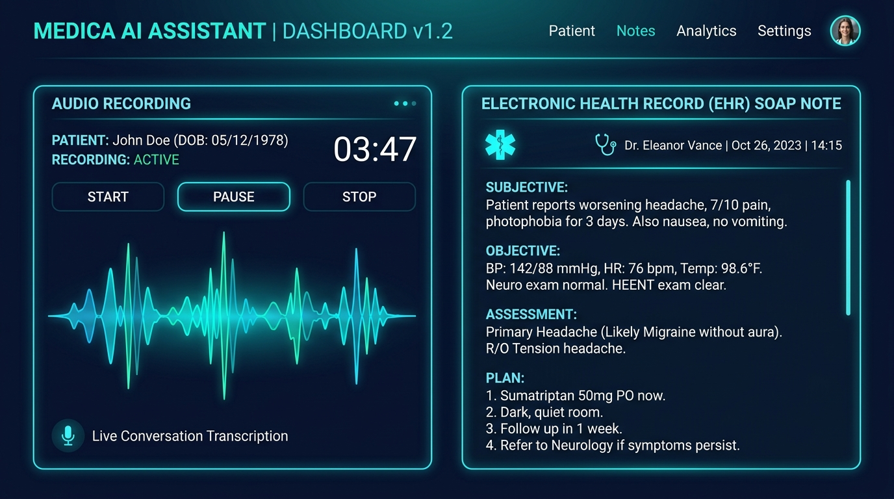
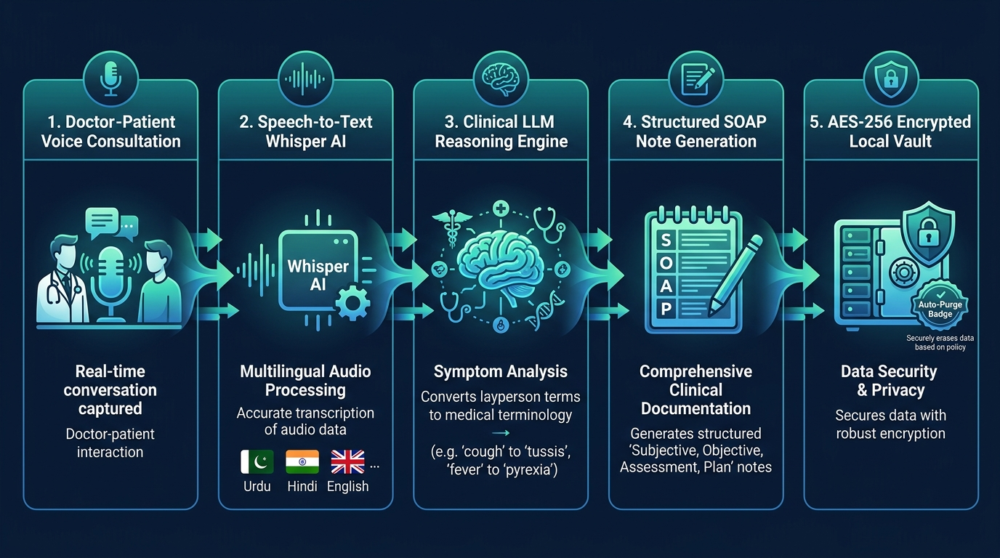
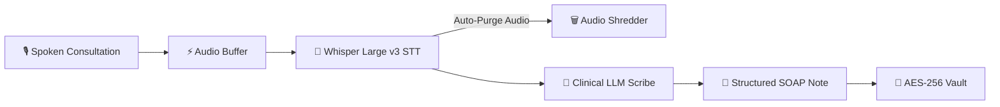

<div align="center">

# 🩺 Mr Doctor
### **Ambient AI Clinical Documentation Specialist & Medical Scribe**
*Empowering clinicians to focus on patients — not paperwork.*

[](https://flutter.dev)
[](https://dart.dev)
[](https://github.com/Muhammad9985/mr-doctor)
[](https://github.com/Muhammad9985/mr-doctor)
[](LICENSE)

<br/>

<p align="center">
  
</p>

[**Explore Releases**](https://github.com/Muhammad9985/mr-doctor/releases) • [**Download APK**](release/MrDoctor.apk) • [**Download Windows App**](release/MrDoctor_Windows.zip) • [**Developer Portfolio**](https://mr-software.online/)

</div>

---

## 📋 Table of Contents
- [Executive Overview](#-executive-overview)
- [Why Mr Doctor? The Clinical Dilemma](#-why-mr-doctor-the-clinical-dilemma)
- [Core Capabilities](#-core-capabilities)
- [System Architecture & Processing Pipeline](#-system-architecture--processing-pipeline)
- [Structured Clinical Output (SOAP Standard)](#-structured-clinical-output-soap-standard)
- [Patient Privacy & Zero-Audio Retention](#-patient-privacy--zero-audio-retention)
- [Quick Start & Installation](#-quick-start--installation)
  - [Android Installation](#-android-installation)
  - [Windows PC Installation](#-windows-pc-installation)
- [Building from Source](#-building-from-source)
- [Technology Stack](#-technology-stack)
- [Clinical Safety & Compliance Disclaimer](#-clinical-safety--compliance-disclaimer)
- [About the Creator & Connect](#-about-the-creator--connect)

---

## 🏥 Executive Overview

**Mr Doctor** is a next-generation **ambient clinical documentation AI** designed to run effortlessly during patient encounters. By capturing raw conversational dialogue between healthcare providers and patients, Mr Doctor eliminates the burden of manual charting. 

Within seconds of finishing an encounter, it synthesizes unedited spoken dialogue into a **board-certified, structured SOAP note** (Subjective, Objective, Assessment, Plan) with ICD-10 diagnostic precision, evidence-based treatment plans, and emergency precautions.

> 🩺 **Primary Physician Benefit:** Saves an average of **2 to 3 hours per clinic day**, eliminating after-hours "pajama-time" EHR charting while restoring meaningful face-to-face eye contact with patients.

---

## ⚡ Why Mr Doctor? The Clinical Dilemma

| Traditional Charting | With Mr Doctor |
| :--- | :--- |
| ❌ Typing notes while patient is speaking | ✅ 100% focused attention and natural eye contact |
| ❌ 2–3 hours of unpaid evening documentation | ✅ Comprehensive note synthesized in under 15 seconds |
| ❌ Incomplete narratives due to physician fatigue | ✅ Rigorous OLDCARTS / OPQRST clinical history tracking |
| ❌ Translating multilingual consultations by hand | ✅ Native comprehension of Urdu, Hindi, Spanish, Arabic & English code-switching |
| ❌ Audio recordings left unencrypted on clinic machines | ✅ **Zero-Retention**: Audio is auto-purged immediately after transcription |

---

## 🌟 Core Capabilities

<p align="center">
  
</p>

### 1. 🎙️ Ambient Consultation Capture
- Single-tap start with responsive real-time audio waveform visualizer.
- Background listening mode allows the doctor to check previous records while recording remains uninterrupted.
- Seamless Pause, Resume, and instantaneous Stop & Synthesize controls.

### 2. 🌐 Multilingual & Code-Switching Comprehension
- Understands complex, mixed colloquial clinical interactions including:
  - **Urdu & Urdu-English (Urdish)**
  - **Hindi & Hinglish**
  - **Arabic**
  - **Spanish**
  - **Standard English**
- Translates layperson colloquial symptom descriptions directly into standardized International Medical Nomenclature:
  - *"Sar ghoom raha hai"* $\rightarrow$ **Vertigo / Presyncope**
  - *"Chaati mein jalan"* $\rightarrow$ **Pyrosis / Gastroesophageal Reflux**
  - *"Saans phool rahi hai"* $\rightarrow$ **Dyspnea (exertional vs at rest)**
  - *"Dil tez dharak raha hai"* $\rightarrow$ **Palpitations / Tachycardia**
  - *"Pait mein maror"* $\rightarrow$ **Abdominal cramping / Colic**

### 3. 🛡️ Zero-Hallucination Clinical Grounding
- Governed by strict prompt-engineering constraints based on **CMS, Joint Commission, and AHIMA** documentation standards.
- Prohibits fabrication of unmentioned vital signs, laboratory data, or medications.
- If physical exam maneuvers were not explicitly verbalized, the note automatically writes:
  > *"No objective measurements or physical exam documented in encounter."*

### 4. 🔒 Military-Grade AES-256 Local Encrypted Vault
- Encrypted patient records stored locally in an on-device Hive database encrypted with **AES-256**.
- Master encryption keys and API credentials secured via platform-native keychains:
  - **Android:** Android KeyStore with EncryptedSharedPreferences.
  - **Windows:** DPAPI (Data Protection API) and Windows Credential Vault.
- Fully offline-accessible archive with real-time patient search.

### 5. 📝 Split-Screen Clinical Workspace & Export
- Side-by-side or tabbed inspection comparing the **Raw Whisper Transcript** against the **Synthesized SOAP Note**.
- Live interactive Markdown editor to tweak dosage instructions or add clinician notes.
- **One-Click Export** to standard `.md` file or direct clipboard copy for instant pasting into Epic, Cerner, AthenaHealth, or any web-based EHR.

---

## 🔄 System Architecture & Processing Pipeline

The clinical transcription and synthesis workflow executes across five distinct, privacy-hardened stages:



1. **Voice Capture:** The app records the clinician-patient dialogue using high-fidelity AAC-LC (128 kbps, 44.1 kHz).
2. **Speech-to-Text (STT):** Audio is processed through Groq Whisper Large v3 or OpenAI Whisper for sub-second, multi-dialect transcription.
3. **Privacy Sanitization:** The temporary audio file is **immediately deleted from storage** as soon as the transcript is produced.
4. **Clinical Synthesis:** The transcript is passed into Gemini 2.0 Flash / LLaMA 3.3 with temperature $0.2$ for deterministic, hallucination-free clinical structuring.
5. **Vault Storage & Review:** The encrypted encounter is saved into local storage, immediately available in the doctor's archive.

---

## 📑 Structured Clinical Output (SOAP Standard)

Every note generated by **Mr Doctor** strictly adheres to modern hospital documentation standards:

```markdown
# Subjective
- **Chief Complaint (CC)**: Sharp retrosternal chest pain radiating to left arm.
- **History of Present Illness (HPI)**: Acute onset 2 hours prior to presentation...
  * OLDCARTS: Onset 2h ago, retrosternal, pressure-like, aggravated by exertion...
  * Pertinent Positives: Diaphoresis, nausea without emesis.
  * Pertinent Negatives: Denies shortness of breath, fever, syncope.
- **Review of Systems (ROS)**: Cardiovascular: Positive for chest pressure...
- **Medications & Allergies**: Atorvastatin 20mg daily; NKDA.

# Objective
- **Vital Signs**: BP 142/88 mmHg, HR 88 bpm, SpO2 98% on room air.
- **Physical Examination**: Normal S1/S2, no murmurs, lungs clear bilaterally.

# Assessment
- **Primary Diagnosis**: Acute Coronary Syndrome (ACS) - Rule out NSTEMI.
- **Differential Diagnoses**: Gastroesophageal reflux disease, costochondritis.

# Plan
- **Diagnostics**: STAT 12-lead ECG, serial high-sensitivity Troponin I, CBC, CMP.
- **Pharmacotherapy**: Aspirin 325mg PO chewed immediately; Sublingual Nitroglycerin PRN.
- **Education & Return Precautions**: Immediate transfer to Emergency Department; return immediately if symptoms worsen.
```

---

## 🔐 Patient Privacy & Zero-Audio Retention

Healthcare confidentiality is paramount. Mr Doctor was built from the ground up with a **Privacy-First** architecture:

- **No Permanent Voice Recordings:** Encounter audio exists temporarily only in system memory/cache during the active visit. The moment Whisper finishes transcription, the audio file is securely unlinked and purged from the device.
- **Local On-Device Vault:** All patient records remain securely on the doctor’s machine. No patient database is hosted on external third-party cloud databases.
- **Zero Third-Party Training:** All API calls utilize private enterprise endpoints (Groq / Google Cloud Vertex / Gemini API) with zero training data retention policies.

---

## 🚀 Quick Start & Installation

Pre-compiled, production-ready release builds are available directly in this repository:

### 📱 Android Installation
1. Download **[`MrDoctor.apk`](release/MrDoctor.apk)** directly to your Android device.
2. Tap the downloaded file to install (*enable "Install from Unknown Sources" if prompted*).
3. Open **Mr Doctor**, navigate to **Settings** (⚙️ icon), and paste your API Key (Groq or Gemini).
4. Tap **Start Clinical Encounter** to begin your first visit!

### 💻 Windows PC Installation
1. Download the zipped package: **[`MrDoctor_Windows.zip`](release/MrDoctor_Windows.zip)**.
2. Right-click and select **Extract All...** to extract to your chosen folder.
3. Open the folder and double-click **`MrDoctor.exe`**.
4. Configure your API keys in Settings and start documenting immediately!

---

## 🛠️ Building from Source

### Prerequisites
- [Flutter SDK](https://docs.flutter.dev/get-started/install) (version 3.24 or later)
- [Dart SDK](https://dart.dev/get-dart)
- For Windows: Visual Studio 2022 with *Desktop development with C++*
- For Android: Android Studio & Android SDK

### Steps
```bash
# 1. Clone the repository
git clone https://github.com/Muhammad9985/mr-doctor.git
cd mr-doctor

# 2. Install dependencies
flutter pub get

# 3. Run unit and clinical parsing test suites
flutter test

# 4. Launch locally on Windows
flutter run -d windows

# 5. Or build release artifacts
flutter build apk --release
flutter build windows --release
```

---

## 🧰 Technology Stack

- **Core Framework:** [Flutter](https://flutter.dev) (Desktop & Mobile)
- **State Management:** [Riverpod 2.x](https://riverpod.dev) (`StateNotifierProvider`)
- **Speech-to-Text Engine:** OpenAI Whisper / Groq Whisper Large v3
- **Clinical Reasoning Engine:** Google Gemini 2.0 Flash / Meta LLaMA 3.3 70B via Groq
- **Audio Capture & Analysis:** `record` with real-time dBFS amplitude stream mapping
- **Encrypted Local Storage:** [Hive](https://docs.hivedb.dev) with AES-256 encryption cipher
- **Credential Storage:** `flutter_secure_storage` (Android KeyStore & Windows DPAPI)
- **Networking:** [Dio](https://pub.dev/packages/dio) with automatic retries and custom interceptors
- **Window Management:** `window_manager` for native desktop window controls

---

## ⚠️ Clinical Safety & Compliance Disclaimer

> **IMPORTANT MEDICAL NOTICE:**  
> **Mr Doctor** is an assistive clinical documentation tool intended to assist licensed healthcare providers. It is not an automated diagnostic system and does not replace professional medical judgment. All generated notes, physical findings, and treatment plans must be reviewed, edited, and approved by the attending physician before committing to permanent medical records or executing clinical orders.

---

## 👨‍💻 About the Creator & Connect

**Mr Doctor** is engineered and maintained by **Muhammad Rafique** — passionate about applying artificial intelligence to healthcare workflows, developer tooling, and modern software architectures.

<div align="center">

[](https://mr-software.online/)
[](https://www.linkedin.com/in/muhammad-rafique-944b05159/)
[](https://github.com/Muhammad9985)

</div>

*If you find Mr Doctor helpful in your clinical or engineering journey, please consider starring ⭐ this repository!*
